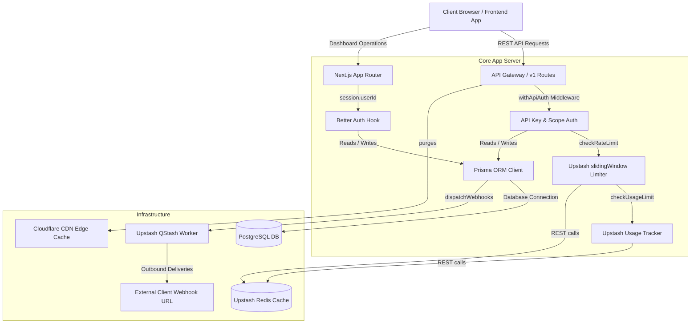

# System Architecture

FlowCMS is designed to be highly modular, type-safe, and horizontally scalable. This document details the key architectural layers that power the platform.

---

---

## 1. Authentication Layer

FlowCMS operates two distinct authentication models:

### Dashboard Authentication (Users)
- Powered by **Better Auth** with the Prisma adapter.
- Configured in `src/lib/auth.ts`.
- **Database Hook Enforcement:** A custom `databaseHooks.session.create.before` hook is registered to block suspended users from logging in, with an emergency bypass for system platform administrators.
- **Session Cache:** Cookie session caching is disabled to prevent stale billing plan states. When a user upgrades or modifies their workspace billing, the session re-evaluates directly from the database on critical actions.

### Public API Authentication (API Consumers)
- Handled via the custom `withApiAuth` and `requireScope` middleware helpers in `src/middleware/with-api-auth.ts`.
- Validates the incoming `Authorization: Bearer flw_<key>` header using timing-safe comparisons.
- Enforces environment scoping and checks endpoint scopes (e.g. `read:entries`). A key with the `admin:workspace` scope bypasses all individual read scope validations.

---

## 2. API Gateway & Middleware Layer

Every public REST request passes through a sequential validation pipeline inside `withApiAuth`:

1. **Extraction & Verification:** Validates the API key format and retrieves workspace, environment, plan, and scope mappings.
2. **Rate Limiting:** Queries Upstash Redis sliding window. Requests exceeding limits are blocked with a `429` response and standard rate-limit headers.
3. **Usage Enforcement:** Checks monthly workspace request limits. Quota-exceeded workspaces receive `402 PLAN_LIMIT_REACHED`.
4. **Execution & Auditing:** Executes the target route handler, writes an audit usage log to PostgreSQL in the background, and returns the response with cache-control headers.

---

## 3. Caching & Cdn Layer

To serve content at scale, FlowCMS uses two caching layers:

- **Redis Caching:** API key lookups and rate limits are cached in Redis (with a 5-minute TTL for verified API key hashes) to avoid database lookups on every request.
- **Edge Caching (Cloudflare):** Responses are decorated with custom caching headers:
  - `Vary: Accept-Encoding, X-Environment-Id` prevents cross-environment caching bleed.
  - `X-Cache-Tag` headers carry `ws:${workspaceId}` and `ws:${workspaceId}:env:${environmentId}` tags.
  - On entry publication or updates, FlowCMS calls `purgeCacheTags` to immediately invalidate cached content at the CDN edge.

---

## 4. Background Webhook Worker Layer (QStash)

Webhooks are dispatched asynchronously using **Upstash QStash**.
- When an event occurs (e.g., `ENTRY_PUBLISHED`), the application calls `dispatchWebhooks()`.
- The helper signs the webhook payload using a SHA-256 HMAC of the combined webhook ID, timestamp, and raw JSON body.
- The webhook delivery task is queued via QStash, which handles HTTP deliveries, logs, and up to 3 retries.
- QStash posts back to an internal endpoint `/api/internal/webhooks/qstash-callback` to update the delivery log (`WebhookDelivery` model) in the database.
