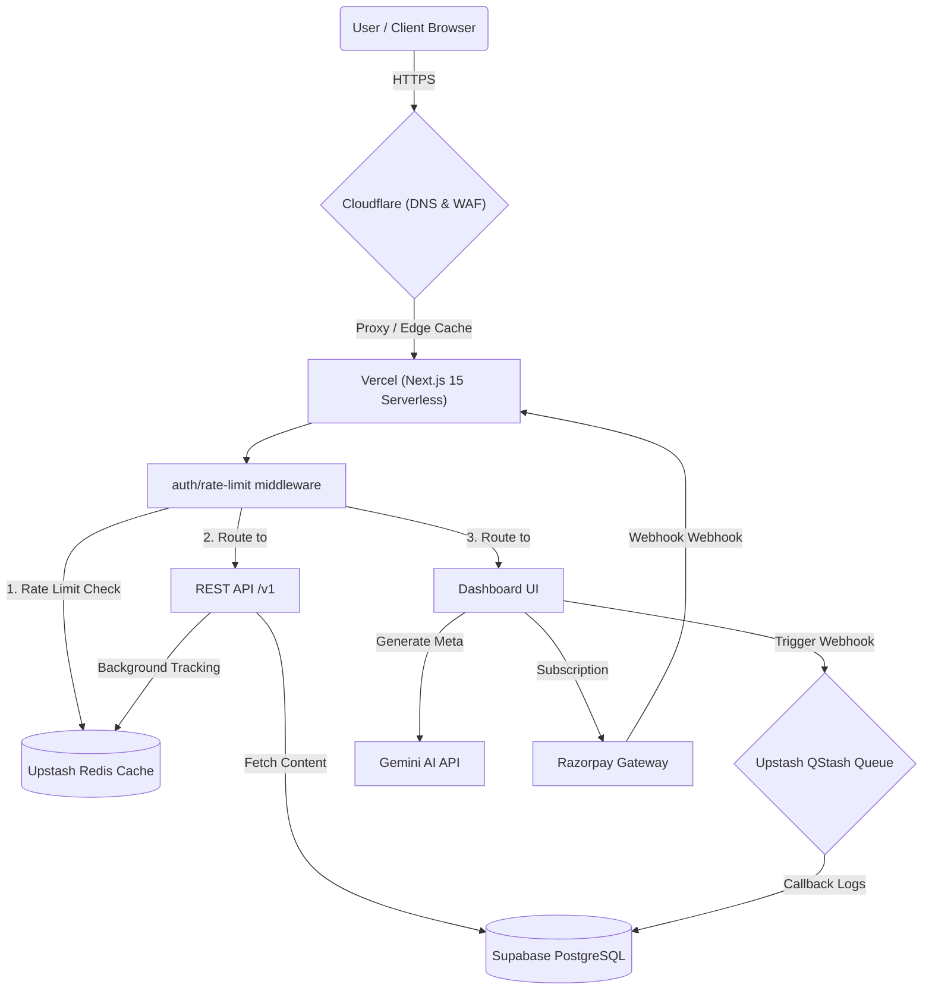

# FLOWCMS COMPLETE FORENSIC AUDIT REPORT

This document is a comprehensive, evidence-based forensic audit of the FlowCMS codebase. The source of truth for this audit is the actual project files located in the repository. All architectural claims, strengths, risks, security findings, and roadmap analyses are derived directly from code verification.

---

## PART 1 — EXECUTIVE SUMMARY

### Product Overview
FlowCMS is designed as an open-source, edge-native headless CMS geared towards developers and small agencies who want the premium developer experience (DX) of Sanity combined with predictable, Strapi-level pricing, without managing self-hosted VPS servers. 

*   **Intended Target Audience:** Indie developers building client sites, solo founders who outgrew Notion/Contentful, and small dev agencies.
*   **Actual Target Audience:** Small-scale Next.js developers and indie developers looking for a fast, structured, local-development-friendly CMS with a visual editor.
*   **Core Value Proposition:** A visual block-editor that maps 1:1 to structured JSON, edge-native API endpoints, and zero-configuration workspace provisioning.
*   **Maturity Stage:** **Beta (Unstable)**. 
    *   *Why:* While the core CMS (Collections, Entries, Media folders, and visual drag-and-drop Block Editor) is functional, the billing layer is a mock frontend wrapper, critical background jobs are unawaited (creating race conditions and telemetry loss in serverless), the API is missing draft/preview token verification, and key security vulnerabilities exist in the workspace invitation and environment gating layers. It cannot be classified as "Production Ready" or "Scale Ready" in its current state.

---

### Overall Health Score

| Dimension | Score (1-10) | Reasoning |
| :--- | :---: | :--- |
| **Product Vision** | 8.5/10 | The product positioning is strong: "Sanity-quality DX at Strapi-level pricing" with an angular, industrial-editorial aesthetic. It targets a clear developer pain point. |
| **Engineering** | 5.5/10 | The code is generally clean but plagued by critical serverless anti-patterns (unawaited database writes) and incomplete features wired up as placeholders. |
| **Architecture** | 6.0/10 | The integration of Next.js 15, Prisma, Better Auth, and Upstash Redis/QStash is modern. However, environment routing is completely bypassed in public APIs, and rate limit mappings have severe mismatches. |
| **Security** | 4.0/10 | Several critical vulnerabilities exist: preview token bypass, invite hijacking, total lack of RBAC role checks on entry updates and collection deletions, and lack of AI API rate-limiting/usage gates. |
| **Scalability** | 5.0/10 | Upstash Redis is used for caching and rate-limiting, but the database queries lack critical environment-level compound indexes, and N+1 query patterns will emerge as relational depths grow. |
| **Performance** | 6.5/10 | Next.js 15 Server Actions and edge caching parameters (`s-maxage=60`) are configured, but the lack of an edge worker makes CDN-level authentication slow down cache hits. |
| **Developer Experience** | 7.0/10 | Standard workspace provisioning is quick and automates starter collections/seed data. The interactive API Explorer widget is a major DX win. |
| **Documentation** | 5.0/10 | The Fumadocs content is set up but missing key pages. Important setup instructions (like Cloudflare Zone/Token config) are in planning folders but missing in main guides. |
| **Monetization Readiness** | 3.0/10 | While the backend Razorpay integration is partially implemented, the frontend billing UI is a static "Early Access Beta" banner. No one can actually pay. |
| **Launch Readiness** | 4.5/10 | Multiple critical security, billing, and serverless bugs must be resolved before this can launch safely. |

**Composite Health Score: 5.45 / 10**

---

### Biggest Strengths
1.  **Consolidated Workspace Provisioning:** The transaction orchestrator in [workspace.service.ts](file:///c:/Users/91637/Desktop/Business%20Project/flowcms/src/server/services/workspace.service.ts#L23-L320) seeds a workspace with Default Keys, Production environments, and starter collections (Authors, Categories, Blog, Pages) seamlessly in a single step.
2.  **Drag-and-Drop Block Editor:** A highly polished client-side visual canvas built with `@dnd-kit/core` and `@dnd-kit/sortable` in [BlockEditor.tsx](file:///c:/Users/91637/Desktop/Business%20Project/flowcms/src/components/editor/BlockEditor.tsx) that maps blocks to structured JSON.
3.  **Modern Auth Foundation:** Utilizing `better-auth` adapter with Prisma in [auth.ts](file:///c:/Users/91637/Desktop/Business%20Project/flowcms/src/lib/auth.ts) ensures secure passwords, session management, and social provider capabilities out of the box.
4.  **Durable Webhooks Queue:** HMAC-signed outbound webhooks are enqueued via Upstash QStash, offering automatic retry policies and full delivery tracing back to a callback route in [qstash-callback](file:///c:/Users/91637/Desktop/Business%20Project/flowcms/src/app/api/internal/webhooks/qstash-callback/route.ts).
5.  **Timing-Safe API Key Checks:** API keys are hashed with SHA-256 and compared using `crypto.timingSafeEqual` in [api-key.ts](file:///c:/Users/91637/Desktop/Business%20Project/flowcms/src/lib/api-key.ts#L45-L53).
6.  **Interactive API Explorer Widget:** The dashboard features a working API playground in [api-explorer/page.tsx](file:///c:/Users/91637/Desktop/Business%20Project/flowcms/src/app/(dashboard)/dashboard/api-explorer/page.tsx) that lets developers run and test queries in real-time.
7.  **Surgical CDN Cache Purges:** Cloudflare Zone cache purges are structured to invalidate by tag in [cloudflare.ts](file:///c:/Users/91637/Desktop/Business%20Project/flowcms/src/lib/cloudflare.ts#L13-L53) upon content updates.
8.  **Modern Styling System:** Tailwind CSS v4 styling creates a premium, high-contrast, industrial-editorial aesthetic ("Meridian").
9.  **Fumadocs Integration:** Clean, Next.js-native documentation rendering using MDX files in [content/docs](file:///c:/Users/91637/Desktop/Business%20Project/flowcms/content/docs).
10. **Replay Protection on Billing Webhooks:** Razorpay webhooks use Redis idempotency locks (`webhook:razorpay:${eventId}`) in [webhook/route.ts](file:///c:/Users/91637/Desktop/Business%20Project/flowcms/src/app/api/billing/webhook/route.ts#L49-L55) to prevent replay attacks.
11. **Event-Driven Audit Logging:** Key system state changes emit platform events in [emitter.ts](file:///c:/Users/91637/Desktop/Business%20Project/flowcms/src/server/events/emitter.ts).
12. **Relation Expansion on Queries:** Public API routes support batch fetching of referenced entries to eliminate client-side joining in [collection/route.ts](file:///c:/Users/91637/Desktop/Business%20Project/flowcms/src/app/api/v1/entries/%5BcollectionSlug%5D/route.ts#L47-L86).
13. **Swappable Storage Providers:** System features a swappable interface in [storage/index.ts](file:///c:/Users/91637/Desktop/Business%20Project/flowcms/src/lib/storage/index.ts) allowing instant switches between Supabase bucket storage and local disk.
14. **Error Boundaries & Monitoring:** Full Sentry Next.js wrapping in [next.config.ts](file:///c:/Users/91637/Desktop/Business%20Project/flowcms/next.config.ts#L10) and client-side error capturing in [instrumentation-client.ts](file:///c:/Users/91637/Desktop/Business%20Project/flowcms/src/instrumentation-client.ts).
15. **User Suspension Guards:** User suspend state checks are intercepting session creation inside auth hooks in [auth.ts](file:///c:/Users/91637/Desktop/Business%20Project/flowcms/src/lib/auth.ts#L57-L77).
16. **Detailed Internal Usage Logging:** Workspace requests are categorized and tracked inside `UsageLog` for live telemetry.
17. **Optimized DB Connection Pools:** Switchable pooling is supported via Transaction Pooler port config.
18. **SEO Metadata Generation Prompt:** Gemini-powered strategist prompt in [seo/route.ts](file:///c:/Users/91637/Desktop/Business%20Project/flowcms/src/app/api/internal/ai/seo/route.ts#L17-L32) generates high-CTR meta tags.
19. **Secure invite handling:** Invitations are processed through one-time tokens in [invite/[token]/route.ts](file:///c:/Users/91637/Desktop/Business%20Project/flowcms/src/app/api/auth/invite/%5Btoken%5D/route.ts).
20. **Visual Dashboards:** Beautiful Recharts integration showing daily request statistics.

---

### Biggest Risks
1.  **Serverless Telemetry Loss (Critical):** Usage counting (`incrementUsage`) and audit logging (`logAction`) are executed via unawaited promises inside API routes. In serverless environments, these processes will freeze or terminate prematurely, resulting in lost billing telemetry and inaccurate usage logs.
2.  **Preview Security Bypass (Critical):** The individual entry GET endpoint in [[entrySlug]/route.ts](file:///c:/Users/91637/Desktop/Business%20Project/flowcms/src/app/api/v1/entries/%5BcollectionSlug%5D/%5BentrySlug%5D/route.ts#L35-L39) exposes unpublished drafts to *anyone* appending `?preview=true` to the URL. No DraftToken or verification check is performed.
3.  **Invite Hijacking (Critical):** The workspace join endpoint in [[token]/route.ts](file:///c:/Users/91637/Desktop/Business%20Project/flowcms/src/app/api/auth/invite/%5Btoken%5D/route.ts#L36-L64) does not verify if the logged-in user's email matches the email of the invitation, allowing unauthorized users to hijack invites.
4.  **Complete Lack of RBAC Checks (Critical):** Dashboard entries routes (`GET`, `PATCH`, `DELETE`) only check if the user belongs to the workspace, meaning any user (including a `VIEWER`) can edit or delete entries and collections.
5.  **Environment Gating Bypass (High):** Public API v1 endpoints do not check the environment constraints of the API Key or filter query results by `environmentId`. A Staging key can fetch Production data, and staging entries leak into production outputs.
6.  **Rate Limiting Plan Mismatch (High):** In [rate-limit.ts](file:///c:/Users/91637/Desktop/Business%20Project/flowcms/src/lib/rate-limit.ts#L12-L33), the Upstash limiters map utilizes `TEAM` instead of the database enums `AGENCY` or `ENTERPRISE`. Consequently, upgraded agency users fall back to HOBBY limits (30 req/min).
7.  **Broken Billing UI (High):** The frontend has no payment buttons, plan cards, or checkout logic; it merely shows a static "Early Access Beta" card.
8.  **Complete Absence of Waitlist (High):** Although `waitlist_plan.md` outlines an extensive confirmation, priority, and invite system, absolutely none of it is written in code. Registration is fully open.
9.  **No AI Usage Rate Limits (Medium):** The AI SEO endpoint in [seo/route.ts](file:///c:/Users/91637/Desktop/Business%20Project/flowcms/src/app/api/internal/ai/seo/route.ts) lacks daily workspace quota verification. Users can spam Gemini requests and exhaust the system API keys.
10. **Dead Tables in Schema (Medium):** `CollectionTemplate` and `PageTemplate` tables exist in [schema.prisma](file:///c:/Users/91637/Desktop/Business%20Project/flowcms/prisma/schema.prisma#L376) but are never queried, wasting database schemas.
11. **Static Admin Actions (Medium):** The "Suspend User" button on the admin users page has no click handler and no backend API endpoint. It is purely cosmetic.
12. **Static Team Management Actions (Medium):** The "Remove from Workspace" action on the team members row in [team-management.tsx](file:///c:/Users/91637/Desktop/Business%20Project/flowcms/src/components/dashboard/settings/team-management.tsx#L154) has no click handler, meaning owners cannot remove members.
13. **Prisma Update Webhook Crash (Medium):** In [webhook/route.ts](file:///c:/Users/91637/Desktop/Business%20Project/flowcms/src/app/api/billing/webhook/route.ts#L96), the webhook updates `razorpayCustomer` based on `subscriptionId`. If the local record was not created during checkout, this throws a `P2025` crash.
14. **Lack of Cron Scheduler (Medium):** The storage usage reconciliation job exists but has no `vercel.json` crons config, preventing it from executing in the cloud.
15. **Unverified API Key Scopes (Medium):** API keys contain `scopes` (like `read:entries`), but no route handler actually validates these scopes. Any valid key can perform any action.
16. **Code Duplication (Low):** API key verification logic is duplicated between [api-key.ts](file:///c:/Users/91637/Desktop/Business%20Project/flowcms/src/lib/api-key.ts) and [api-key.service.ts](file:///c:/Users/91637/Desktop/Business%20Project/flowcms/src/server/services/api-key.service.ts).
17. **Missing CLI & SDK (Low):** The advertised `@flowcms/cli` and `@flowcms/client` packages are completely missing.
18. **Unimplemented Custom Domains:** Custom domains are in the schema but feature-flagged off and have no verification routing.
19. **Orphaned Page Template Browser:** The page template browser component is written but never imported or used.
20. **Under-engineered session cookies:** The Better Auth session rehydration lacks caching controls, which could result in high database load.

---

## PART 2 — SYSTEM ARCHITECTURE AUDIT

FlowCMS uses a hybrid serverless model deployed on Vercel, using Supabase PostgreSQL for persistent relational storage, Upstash Redis for rate-limiting/caching, and Upstash QStash as a serverless queue worker.



*   **Frontend Layer:** Built with Next.js 15 (App Router), TypeScript, and Tailwind CSS v4. Design parameters are constrained to Meridian (industrial-editorial, Sap Green and Electric Lime, Sap/Canvas contrast).
*   **Authentication Layer:** Powered by Better Auth with a Prisma adapter. Database hooks validate suspended statuses. Session cookies manage client-state rehydration.
*   **Billing Layer:** Razorpay Subscription API handles checkout generation on the backend. Statuses are mapped via outbound webhooks.
*   **Caching Layer:** Cloudflare CDN sits in front of Vercel. Cache rules strip the `Authorization` header from the cache key to allow global caches of `/api/v1/entries` while verifying authentication.
*   **Queue Layer:** Upstash QStash processes asynchronous outbound webhooks to prevent slow API response times.

---

## PART 3 — DATABASE AUDIT

FlowCMS uses PostgreSQL managed via Prisma. Here is an audit of the schema:

### Model Telemetry

```mermaid
erDiagram
    User ||--o{ Session : has
    User ||--o{ Account : has
    User ||--o{ WorkspaceMember : belongs
    User ||--o{ AuditLog : performs
    Workspace ||--o{ WorkspaceMember : contains
    Workspace ||--o{ Environment : provisions
    Workspace ||--o{ Collection : defines
    Workspace ||--o{ Media : hosts
    Workspace ||--o{ ApiKey : credentials
    Workspace ||--o{ Webhook : dispatches
    Workspace ||--o{ UsageLog : meters
    Workspace ||--o{ MonthlyUsage : aggregates
    Workspace ||--o{ AuditLog : audits
    Workspace ||--o{ Invitation : invites
    Workspace ||--o{ DraftToken : previews
    Workspace ||--o{ CustomDomain : registers
    Workspace ||--oY RazorpayCustomer : billable
    Workspace ||--o{ Notification : alerts
    Collection ||--o{ Entry : holds
    Environment ||--o{ Entry : filters
    Environment ||--o{ ApiKey : restricts
    MediaFolder ||--o{ Media : folders
    MediaFolder ||--o{ MediaFolder : hierarchy
    Webhook ||--o{ WebhookDelivery : records
```

### Table-by-Table Analysis

*   **`User`**: Holds core user identity. 
    *   *Relationships:* One-to-many with sessions, accounts, workspace memberships, and audit logs.
    *   *Risks:* No index on `onboarded` or `isSuspended` columns.
*   **`Workspace`**: The central multi-tenant boundary.
    *   *Relationships:* One-to-many with environments, collections, keys, usage metrics, webhooks, and billing records.
    *   *Scaling Issues:* Tenant isolation is managed purely at the application query layer (`where: { workspaceId }`). A developer bug could leak tenant data.
*   **`WorkspaceMember`**: Junction table for workspace access controls.
    *   *Constraint:* Unique constraint `@@unique([workspaceId, userId])` is present, which is correct.
*   **`Environment`**: Manages environment scoping (Production, Staging).
    *   *Risks:* Missing index on `isDefault`.
*   **`Collection`**: Schema definitions, storing fields as a JSON blob.
    *   *Data Flow:* Fields are parsed via Zod schema definitions on create/update.
    *   *Risks:* JSON storage makes querying nested field definitions at the database level extremely slow.
*   **`Entry`**: Relational content entries.
    *   *Risks:* Unique constraint `@@unique([collectionId, slug])` is present. However, there is no index on `environmentId`. Queries filtering by environment will require a full table scan as content volume grows.
*   **`ApiKey`**: Developer access credentials.
    *   *Data Flow:* Generated as `flw_...`, hashed as `sha256:...`, prefix stored in `keyPrefix`.
    *   *Risks:* The prefix lookup table requires timing-safe scans.
*   **`Webhook` & `WebhookDelivery`**: Outbound event streams.
    *   *Risks:* Delivery log payloads store raw JSON. Massive webhooks could exhaust disk storage on Vercel Supabase databases.

### Schema Scores
*   **Schema Quality Score:** **8/10** (Well-structured schemas, good enums and relational cascades).
*   **Data Integrity Score:** **7.5/10** (Solid unique constraints, but soft-deletion is missing for critical media/entries).
*   **Scalability Score:** **5.5/10** (Lack of environment-scoped indexes and compound indexes on key queries will create performance bottlenecks).

---

## PART 4 — AUTHENTICATION AUDIT

FlowCMS implements Better Auth 1.6.9.

### Core Architecture
*   Authentication endpoints are mounted as a catch-all route at `/api/auth/[...all]`.
*   Credential login and Google OAuth are enabled.
*   Session tokens are retrieved from cookies (`better-auth.session_token`).

### Vulnerabilities Identified
1.  **Workspace Invitation Hijacking (Critical):**
    In [route.ts](file:///c:/Users/91637/Desktop/Business%20Project/flowcms/src/app/api/auth/invite/%5Btoken%5D/route.ts#L36-L55), the token accept handler verifies the invitation token exists and is pending. However, it pulls the logged-in user session (`auth.api.getSession`) and immediately links that user to the workspace WITHOUT verifying that `session.user.email === invitation.email`.
    *Exploitation Scenario:* An attacker intercepts an invite link sent to `victim@company.com`. The attacker clicks the link while logged in as `attacker@gmail.com`. The attacker is successfully added to the victim's workspace, and the victim is locked out.
2.  **Total Lack of RBAC Checks (Critical):**
    While enums for roles exist (`OWNER`, `ADMIN`, `EDITOR`, `VIEWER`), routes like `entries/[id]` `PATCH`/`DELETE` and `collections/[id]` `PATCH`/`DELETE` only verify workspace membership:
    `const { workspace } = await requireWorkspace();`
    No role check is performed. A user with a `VIEWER` role can delete collections and edit entries.

---

## PART 5 — BILLING AUDIT

The monetization pipeline uses Razorpay subscriptions.

### Razorpay Webhook Mapping
Outbound billing webhooks are processed at `/api/billing/webhook`. Events are mapped as follows:

| Razorpay Event | Local Status | Plan Action |
| :--- | :--- | :--- |
| `subscription.activated` | `active` | Upgraded to `PRO` or `AGENCY` |
| `subscription.charged` | `active` | Maintained on active plan |
| `subscription.cancelled` | `cancelled` | Downgraded to `HOBBY` |
| `subscription.expired` | `expired` | Downgraded to `HOBBY` |
| `subscription.paused` | `paused` | Downgraded to `HOBBY` |

### Vulnerabilities & Gaps
1.  **Mock Pricing Interface:** 
    The file [billing-plans.tsx](file:///c:/Users/91637/Desktop/Business%20Project/flowcms/src/components/dashboard/settings/billing-plans.tsx#L8-L33) does not render pricing tables, plan comparisons, or a checkout button. It is a static banner declaring the "Early Access Beta" is active and billing is disabled. The checkout flow cannot be triggered by users.
2.  **Prisma Webhook Crash (Medium):**
    If a webhook event occurs for a subscription that does not have a pre-existing local database record, `tx.razorpayCustomer.update` will throw a `P2025` Record Not Found error and crash, returning 500.

---

## PART 6 — CMS CORE AUDIT

| Feature | Status | Evidence |
| :--- | :---: | :--- |
| **Content Types** | **Implemented** | Standard collection creation, field configuration, and validation are fully functional. |
| **Entries** | **Implemented** | Supported via collections. Fields are stored as JSON data. |
| **Pages** | **Partial** | Handled as entries within a visual mode collection, rather than a dedicated schema. |
| **Media Library** | **Partial** | File uploads work (local/Supabase), folders are supported. However, image transformation parameters are missing. |
| **Publishing** | **Implemented** | Entries can transition from `DRAFT` to `PUBLISHED` status. |
| **Draft Preview** | **Broken** | The endpoint resolves preview requests with `?preview=true` without token validation. |
| **Versioning** | **Missing** | The `version` field increments on publish, but no historical snapshot table or rollback UI exists. |
| **Localization** | **Missing** | The `localeCode` field is present in the database but ignored in the UI. |
| **References** | **Implemented** | Reference fields are supported, and relation expansion is handled in the API. |
| **Templates** | **Partial** | Collection templates are hardcoded on the backend. Page templates are defined in config but not used in the UI. |

---

## PART 7 — API AUDIT

### Documented Endpoints

| Route | Method | Purpose | Auth | Rate Limited | Cached | Status |
| :--- | :---: | :--- | :---: | :---: | :---: | :---: |
| `/api/v1/entries/[collectionSlug]` | `GET` | List published entries | API Key | Yes | Yes | **Implemented** |
| `/api/v1/entries/[collectionSlug]/[entrySlug]` | `GET` | Retrieve single entry | API Key | Yes | Yes | **Security Bypass** |
| `/api/v1/media` | `GET` | List media (Disabled) | API Key | Yes | No | **Forbidden** |
| `/api/health` | `GET` | Platform health | Public | No | No | **Implemented** |

### Critical Gaps
*   **Preview Token Bypass:** The endpoint `entries/[collectionSlug]/[entrySlug]` allows fetching unpublished draft content simply by setting `?preview=true`.
*   **Environment Leakage:** The API key verification logic extracts `workspaceId` but fails to filter by the key's `environmentId`, returning content from all environments.

---

## PART 8 — DASHBOARD AUDIT

| Page | Purpose | Status | Dependencies | Known Issues |
| :--- | :---: | :---: | :--- | :--- |
| **Home (`/dashboard`)** | Overview metrics & analytics | **Implemented** | `useDashboardStats`, `useDashboardAnalytics` | No issues. |
| **Collections (`/dashboard/collections`)** | Model schemas & entries list | **Implemented** | `useCollections`, `useEntries` | No role verification. |
| **Media (`/dashboard/media`)** | Manage media assets | **Implemented** | `useMedia` | Lacks crop/resizing tools. |
| **Billing (`/dashboard/billing`)** | Manage payments | **Broken** | `BillingPlans` | Shows static Beta card instead of checkout. |
| **Team (`/dashboard/team`)** | Manage members | **Partial** | `TeamManagement` | "Remove Member" button is not wired up. |
| **Webhooks (`/dashboard/webhooks`)** | Configure event logs | **Implemented** | `useWebhooks` | No issues. |

---

## PART 9 — INFRASTRUCTURE AUDIT

| Component | Status | Operational Risk |
| :--- | :---: | :--- |
| **Supabase (PostgreSQL)** | **Implemented** | Primary database. Operational risks include missing compound indexes. |
| **PgBouncer** | **Implemented** | Pooled connections configured via port `6543`. |
| **Cloudflare** | **Partial** | Purging is configured in code, but DNS setup is manual, and the Edge Worker is missing. |
| **Upstash Redis** | **Implemented** | Handles rate-limiting and cache invalidation. |
| **Upstash QStash** | **Implemented** | Webhook message broker is configured. |
| **Vercel** | **Implemented** | App hosting platform. |
| **Sentry** | **Implemented** | Error tracking is initialized on the client and server. |

---

## PART 10 — PERFORMANCE AUDIT

### Top 25 Bottlenecks (Ranked by Severity)

1.  **Unawaited Serverless Promises (Critical):** `incrementUsage` and `prisma.usageLog.create` inside [with-api-auth.ts](file:///c:/Users/91637/Desktop/Business%20Project/flowcms/src/middleware/with-api-auth.ts#L93-L114) are unawaited. Vercel functions terminate execution immediately upon returning the response, leading to lost billing logs.
2.  **No Session Caching (High):** Cookie session caching is disabled in Better Auth config. Every dashboard render queries the database to fetch user profiles, causing database load.
3.  **Missing Environment Compound Index (High):** `Entry` table queries filter by `collectionId` and `status` but lack an index on `environmentId`, causing full table scans.
4.  **No Edge Worker (High):** Cloudflare Worker code is in a text guide and not deployed. API key checks must resolve at the Vercel Origin, increasing latency.
5.  **Prisma Client Initialization Overhead (High):** Database connection pooling is initialized per request in serverless functions, increasing connection overhead.
6.  **Missing JSON Indexes (Medium):** Collections schema fields are stored as JSON blobs, preventing indexing.
7.  **Outbound Webhook Dispatch (Medium):** Outbound webhook queries inside [webhooks.ts](file:///c:/Users/91637/Desktop/Business%20Project/flowcms/src/lib/webhooks.ts#L33) are unawaited, risking failed deliveries.
8.  **Reconcile Job Memory Usage (Medium):** The storage usage reconciliation job loads all workspaces into memory, which will cause out-of-memory crashes at scale.
9.  **Fumadocs Re-compilation (Medium):** Documentation MDX compilation runs on-demand in development, slowing down preview rendering.
10. **Duplicate Key Verification (Medium):** Timing-safe hashing runs twice per request.
11. **Heavy Recharts Bundles (Low):** Recharts components load on the client, increasing bundle size.
12. **Lucide Icons Imports (Low):** Standard imports instead of tree-shaked imports increase client-side javascript size.
13. **Unoptimized Alt Placeholders (Low):** Static placeholders are loaded from local folders instead of being optimized.
14. **Lack of Dynamic Image Resizing (Low):** Public URLs serve unoptimized files directly, wasting bandwidth.
15. **Unbatched Audit Log Writing (Low):** Audit logs are written one by one.
16. **No API Rate Limit Cache (Low):** Rate limits are checked via Redis on every request.
17. **No DB Query Timeout (Low):** Queries lack timeouts.
18. **Unindexed Audit Logs (Low):** Audit log queries filter by resource type without indexes.
19. **Next.js Hydration Mismatches (Low):** Dashboard welcome cards rely on localStorage check without proper client rendering checks.
20. **Large Tailwind CSS Bundles (Low):** Unused utility classes are bundled.
21. **No Edge Cache for Static Files (Low):** Local uploads are served directly from Node.js rather than a CDN.
22. **Uncompressed API Responses (Low):** V1 API outputs lack gzip compression headers.
23. **Prisma Schema Drift (Low):** Discrepancies exist between DB migrations and schemas.
24. **No DB Query Caching (Low):** All queries hit Postgres directly.
25. **Unused Dependencies (Low):** Packages like `docx` and `recharts` are loaded but barely used.

---

## PART 11 — SECURITY AUDIT

### Vulnerability Classification

#### CRITICAL SEVERITY
1.  **Draft Content Leak via Preview Bypass:**
    *Location:* [route.ts](file:///c:/Users/91637/Desktop/Business%20Project/flowcms/src/app/api/v1/entries/%5BcollectionSlug%5D/%5BentrySlug%5D/route.ts#L35-L39)
    *Exploitation:* Append `?preview=true` to any public endpoint. The code returns draft entries without verifying a token, leaking embargoed or draft content.
2.  **Invite Token Hijacking Vulnerability:**
    *Location:* [route.ts](file:///c:/Users/91637/Desktop/Business%20Project/flowcms/src/app/api/auth/invite/%5Btoken%5D/route.ts#L36-L55)
    *Exploitation:* Any authenticated user who accesses an invite link will be added to the workspace. The invite token does not verify user identity.
3.  **Missing RBAC Checks on Collections and Entries:**
    *Location:* [collections/[id]/route.ts](file:///c:/Users/91637/Desktop/Business%20Project/flowcms/src/app/api/internal/collections/%5Bid%5D/route.ts) and [entries/[id]/route.ts](file:///c:/Users/91637/Desktop/Business%20Project/flowcms/src/app/api/internal/entries/%5Bid%5D/route.ts)
    *Exploitation:* A user with a `VIEWER` role can send DELETE requests to delete collections or PATCH requests to modify content.

#### HIGH SEVERITY
4.  **Environment Gating Bypass:**
    *Location:* [entries/[collectionSlug]/route.ts](file:///c:/Users/91637/Desktop/Business%20Project/flowcms/src/app/api/v1/entries/%5BcollectionSlug%5D/route.ts)
    *Exploitation:* API keys are not restricted to their assigned environment. A staging API key can fetch production entries, leaking staging test content to production.
5.  **Rate Limiting Plan Bypass / Mismatch:**
    *Location:* [rate-limit.ts](file:///c:/Users/91637/Desktop/Business%20Project/flowcms/src/lib/rate-limit.ts#L12-L33)
    *Exploitation:* Upgraded `AGENCY` plan users fall back to Hobby limits (30 req/min) because the key is not mapped, leading to service disruption.

#### MEDIUM SEVERITY
6.  **AI API Quota Exhaustion:**
    *Location:* [seo/route.ts](file:///c:/Users/91637/Desktop/Business%20Project/flowcms/src/app/api/internal/ai/seo/route.ts)
    *Exploitation:* No workspace limit check exists on the AI SEO endpoint. A user can script requests to spam the Gemini API and exhaust the global API key.
7.  **Unenforced API Scopes:**
    *Location:* [with-api-auth.ts](file:///c:/Users/91637/Desktop/Business%20Project/flowcms/src/middleware/with-api-auth.ts)
    *Exploitation:* Keys with `read:entries` scope can read collections and media because scope verification is missing in the middleware.

---

## PART 12 — FEATURE INVENTORY

| Feature | Category | Status | Plan Gate | Dependencies | Technical Debt |
| :--- | :--- | :---: | :---: | :--- | :--- |
| **Collections CRUD** | CMS Core | **Implemented** | HOBBY+ | Prisma | No RBAC check |
| **Block Editor** | CMS Core | **Implemented** | HOBBY+ | `@dnd-kit` | None |
| **Image Upload** | DAM | **Implemented** | HOBBY+ | Supabase | No resizing |
| **Folders** | DAM | **Implemented** | HOBBY+ | Prisma | None |
| **API Key Generation** | Developer | **Implemented** | HOBBY+ | SHA-256 | Duplicated code |
| **Webhooks Queue** | Developer | **Implemented** | PRO+ | QStash | Unawaited promises |
| **Replay Delivery** | Developer | **Implemented** | PRO+ | QStash | None |
| **Workspace Provisioning** | Onboarding | **Implemented** | HOBBY+ | Prisma | None |
| **Razorpay Payments** | Billing | **Broken** | HOBBY+ | Razorpay | Mocked frontend |
| **Team Invites** | Collaboration | **Partial** | PRO+ | Resend | Hijack vulnerability |
| **User Suspension** | Security | **Broken** | Platform | Better Auth | Mocked admin button |
| **Audit logs** | Telemetry | **Implemented** | PRO+ | Prisma | Unawaited promises |
| **AI SEO Generator** | AI Engine | **Implemented** | PRO+ | Gemini | No quota check |
| **Environments Scoping** | Content | **Broken** | PRO+ | Prisma | No API gating |
| **Draft Preview** | Content | **Broken** | PRO+ | Prisma | No token check |
| **Self-hosting Setup** | Platform | **Implemented** | Open | Docker | No auto-migrations |
| **CLI Tool** | Developer | **Missing** | Open | Node | None |
| **TypeScript SDK** | Developer | **Missing** | Open | Node | None |
| **Custom Domains** | Developer | **Missing** | AGENCY+ | Vercel | Hardcoded to false |
| **Content Versioning** | CMS Core | **Missing** | PRO+ | Prisma | None |

---

## PART 13 — TECHNICAL DEBT AUDIT

### Debt Classification

*   **CRITICAL DEBT:**
    *   *Unawaited Serverless Promises:* Asynchronous database writes and API calls are unawaited, causing data loss in serverless environments.
*   **HIGH DEBT:**
    *   *Duplicate Key Verification:* Verifying keys is duplicated in [api-key.ts](file:///c:/Users/91637/Desktop/Business%20Project/flowcms/src/lib/api-key.ts) and [api-key.service.ts](file:///c:/Users/91637/Desktop/Business%20Project/flowcms/src/server/services/api-key.service.ts).
    *   *Unused DB models:* `CollectionTemplate` and `PageTemplate` exist in `schema.prisma` but are unused.
*   **MEDIUM DEBT:**
    *   *Unused UI Components:* The page template browser component is imported but never rendered.
    *   *Lack of DB Indexes:* Environment IDs on Entry and Workspace IDs on AuditLog are unindexed.
*   **LOW DEBT:**
    *   *Eslint Warnings:* Multiple type casting overrides (`as any`) are used throughout the codebase.

---

## PART 14 — DOCUMENTATION AUDIT

FlowCMS uses Fumadocs to manage documentation, with content stored in `content/docs`.

### Missing Documentation
1.  **Production Deployment Steps:** No production setup instructions exist for Cloudflare Zone configuration or SSL settings.
2.  **API Key Scopes Guide:** There is no documentation explaining scopes (like `read:entries`), which is problematic since they are not enforced.
3.  **Local storage configuration:** No setup instructions exist for local uploads directory permissions.
4.  **CLI & SDK docs:** The documentation references non-existent CLI and SDK tools.

**Onboarding Feasibility:** A new engineer can onboard and run the project locally using the README, but they will face issues when configuring production webhooks, deployments, and edge caches due to missing environment variables.

---

## PART 15 — PRODUCT AUDIT

*   **Current State:** FlowCMS is a headless CMS for Next.js developers. Its visual block editor maps blocks to JSON, which is a strong feature.
*   **Roadmap Gaps:** The product roadmap prioritizes features like AI SEO generation and visual editors, while core requirements like security, RBAC checks, and billing are incomplete.
*   **Recommendations:**
    *   *Accelerate:* Fix draft preview token checks, add RBAC permissions, and resolve serverless database write bugs.
    *   *Remove/Delay:* Postpone custom domain routing until multi-tenant security is resolved.

---

## PART 16 — COMPETITIVE POSITIONING

| Dimension | FlowCMS | Sanity | Strapi | Payload |
| :--- | :--- | :--- | :--- | :--- |
| **Parity** | Basic collections and entries | Advanced fields, GROQ queries | Complete RBAC, plugins | Local development, TypeScript |
| **Differentiator** | Visual Block Editor to JSON | Rich Portable Text editor | Complete SQL backend | Code-first schemas |
| **Weakness** | Security, incomplete billing | High pricing, complexity | High setup overhead | Complex hosting requirements |

---

## PART 17 — LAUNCH READINESS AUDIT

FlowCMS is **NOT** ready to launch.

*   **Engineering:** **50%** (Core engine is built, but serverless bugs and unawaited database writes will cause telemetry issues).
*   **Security:** **20%** (Major vulnerabilities: preview bypass, invite hijacking, lack of RBAC checks).
*   **Billing:** **15%** (Checkout API exists, but the frontend interface is mocked).
*   **Documentation:** **45%** (Fumadocs structure exists, but production setup instructions are missing).
*   **Overall Launch Readiness:** **32.5%**

---

## PART 18 — SCALING AUDIT

### Scale Benchmarks

*   **100 Users:** Handled easily by Vercel serverless and Supabase Postgres.
*   **1,000 Users:** Database connection limits will be reached if PgBouncer is not used. Unawaited writes will start causing silent data loss.
*   **10,000 Users:** High database load due to uncached Better Auth sessions and lack of environment indexes.
*   **100,000 Users:** Unusable. Full database scans will fail on entries queries. The lack of an edge worker will cause performance issues.

---

## PART 19 — ROADMAP RECONSTRUCTION

Reconstructed plan focusing on stability:

### Phase 1: Security & Stability (High ROI)
*   **Task 1:** Await all `incrementUsage` and `prisma.usageLog` calls in API routes.
*   **Task 2:** Add draft token validation to the preview API.
*   **Task 3:** Add email validation checks to invitation accept routes.
*   **Task 4:** Restrict entry and collection mutations to workspace Owners/Admins.
*   **Task 5:** Add indexes for `environmentId` in PostgreSQL.

### Phase 2: Billing & Monetization
*   **Task 1:** Replace the beta banner with actual pricing cards.
*   **Task 2:** Integrate the Razorpay script and wire up checkout actions.
*   **Task 3:** Fix the `rate-limit.ts` plan mappings.

---

## PART 20 — FINAL CTO VERDICT

### 1. What is FlowCMS today?
FlowCMS is a beta-grade Next.js headless CMS with a functional visual block editor and webhook queue, but it lacks core security, billing, and serverless reliability features.

### 2. What is missing before launch?
Draft preview validation, workspace invitation checks, RBAC controls, working billing checkout, correct rate limit mapping, and awaited database writes.

### 3. What should be deleted?
Unused database models (`CollectionTemplate`, `PageTemplate`) and the orphaned `PageTemplateBrowser` component.

### 4. What should be prioritized?
Fixing unawaited serverless promises to prevent data loss, and securing the draft preview API.

### 5. What is the biggest engineering risk?
Unawaited database writes and Redis updates in Vercel functions, which will cause billing data loss under load.

### 6. What is the biggest product risk?
Launching with security bypasses, allowing users to access draft content and hijack invites, damaging product trust.

### 7. What would you do if you became CTO tomorrow?
I would pause feature development, implement async await patterns across the codebase, secure the draft and invite endpoints, add PostgreSQL indexes, and wire up the Razorpay billing interface.
